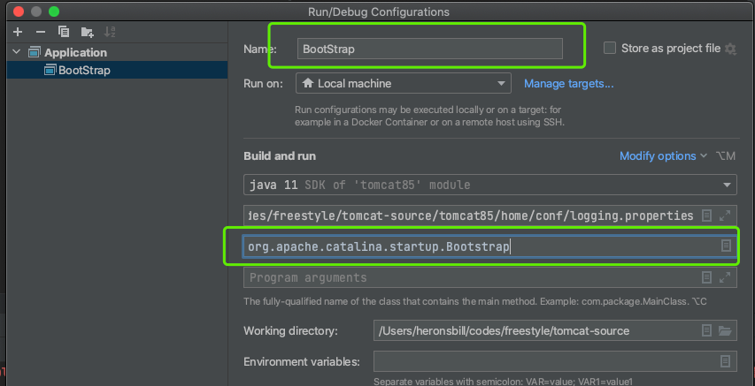
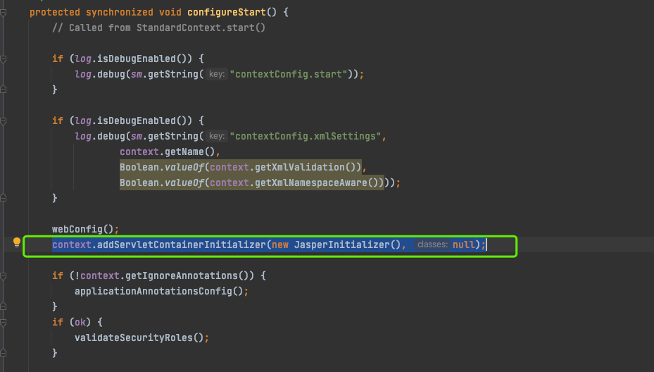

1、指定主类

2、vm配置中指定参数
-Dcatalina.home=/Users/heronsbill/codes/freestyle/tomcat-source/tomcat85/home
-Dcatalina.base=/Users/heronsbill/codes/freestyle/tomcat-source/tomcat85/home
-Djava.util.logging.manager=org.apache.juli.ClassLoaderLogManager
-Djava.util.logging.config.file=/Users/heronsbill/codes/freestyle/tomcat-source/tomcat85/home/conf/logging.properties

3、ContextConfig中添加 JasperInitializer
context.addServletContainerInitializer(new JasperInitializer(), null);

